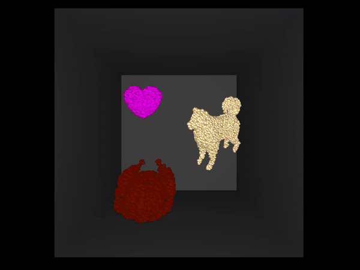
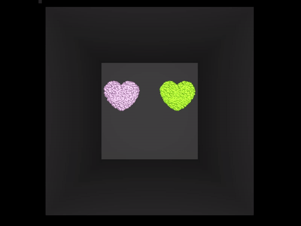
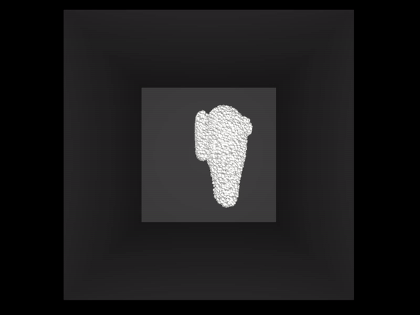
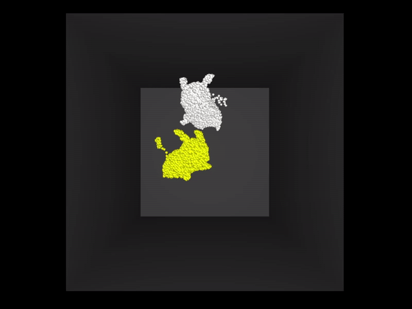
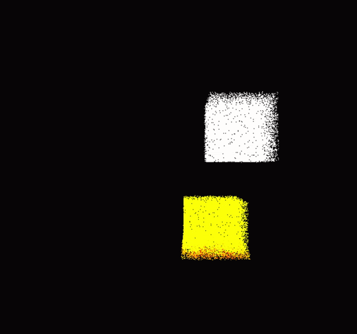

# WebGPU Material Point Method

## Jiecong "Jacky" Lu, Chetan Parthiban, Haorong (Henry) Yang
MPM is a hybrid Eulerian/Lagrangian method for the simulation of physically accurate materials. In this project, we show off the compute capabilities of WebGPU to implement a MPM simulator allowing for the real-time simulation of 200k particles from a selection of three materials (Fluids, Jellos, and Snow). The GIFs in the final results are sped up 8 times and the ones in the midpoint results are realtime.

## Demo Links:

[http://chetanp.io/WebGPUMPM](http://chetanp.io/WebGPUMPM)

[https://jackylu0124.github.io/WebGPUMPM](https://jackylu0124.github.io/WebGPUMPM)

### Run this demo live using Chrome Canary behind the flag `--enable-unsafe-webgpu`. 
#### &nbsp;&nbsp;&nbsp;&nbsp; Step 1. Get Chrome Canary [here](https://www.google.com/intl/en_in/chrome/canary/).
#### &nbsp;&nbsp;&nbsp;&nbsp; Step 2. Enable WebGPU at `chrome://flags/#enable-unsafe-webgpu`.


Three Materials Coupling       |   Fluid Interaction
:-------------------------:|:-------------------------:
|  |

Three Jello Collision        |   Two Jello Hearts
:-------------------------:|:-------------------------:
|  |

Snow Smash        |   Snow & Jello Pikachus
:-------------------------:|:-------------------------:
|  |


### MidPoint Results
Fluid & Jello Coupling        |   Snow & Jello Coupling
:-------------------------:|:-------------------------:
|  |


## More WebGPU Samples to get started with WebGPU

This repo was built from the  [WebGPU Samples Repo](//austineng.github.io/webgpu-samples/), a set of WGSL
and SPIR-V compatible samples demonstrating the use of the [WebGPU API](//webgpu.dev). Please see the current implementation status at
[webgpu.io](//webgpu.io). 

These samples run in Chrome Canary behind the flag `--enable-unsafe-webgpu`. If
something isn't working, please file an issue
[here](https://github.com/austinEng/webgpu-samples/issues). You can get Chrome Canary [here](https://www.google.com/intl/en_in/chrome/canary/).

## Building this project
This project is built with [Typescript](https://www.typescriptlang.org/)
and compiled using [webpack](https://webpack.js.org/). Building the project
requires an installation of [Node.js](https://nodejs.org/en/).

- Install dependencies: `npm install`.
- For development, start the dev server which will watch and recompile
  sources: `npm start`.
- For production, compile the project: `npm run build`.
- To view the project locally in the browser, start a web server in the project
  root directory. [`http-server`](https://www.npmjs.com/package/http-server) is
  the recommended package.

### How to run from cloned source

```
npm install
npm run-script build   # or `npm start` and do the following in a separate terminal
npm run-script serve
```

## Special Thanks
**This project would not have been possible without the guidances from Austin Eng, Kai Ninomiya, Dr. Chenfanfu Jiang, and the WebGPU team.**

## Credits
1. https://gpuweb.github.io/gpuweb/
2. [Ming Gao, Xinlei Wang, Kui Wu, Andre Pradhana, Eftychios Sifakis, Cem Yuksel, and Chenfanfu Jiang. 2018. GPU optimization of material point methods. ACM Trans. Graph. 37, 6, Article 254 (November 2018), 12 pages.](https://doi.org/10.1145/3272127.3275044)
3. [GLSL SVD Implementation From @alexsr](https://gist.github.com/alexsr/5065f0189a7af13b2f3bc43d22aff62f)
4. [Joshuah Wolper, Yunuo Chen, Minchen Li, Yu Fang, Ziyin Qu, Jiecong Lu, Meggie Cheng, and Chenfanfu Jiang. 2020. AnisoMPM: Animating Anisotropic Damage Mechanics. ACM Trans. Graph. 39, 4, Article 37 (July 2020), 16 pages.](https://doi.org/10.1145/3386569.3392428)
5. [Gaume, J., Gast, T., Teran, J. et al. Dynamic anticrack propagation in snow. Nat Commun 9, 3047 (2018).](https://doi.org/10.1038/s41467-018-05181-w)
6. [Stomakhin, A., Schroeder, C., Chai, L., Teran, J., Selle, A. 2013. A Material Point Method for Snow Simulation. ACM Trans. Graph. 32, 4, Article 102 (July 2013), 12 pages.](http://doi.acm.org/10.1145/2461912.2461948)
7. https://en.wikipedia.org/wiki/Material_point_method
8. [Chenfanfu Jiang, Craig Schroeder, Joseph Teran, Alexey Stomakhin, and Andrew Selle. 2016. The material point method for simulating continuum materials. In ACM SIGGRAPH 2016 Courses (SIGGRAPH '16). Association for Computing Machinery, New York, NY, USA, Article 24, 1–52.](https://doi.org/10.1145/2897826.2927348)
9. https://developers.google.com/web/updates/2019/08/get-started-with-gpu-compute-on-the-web


## Model Credits
1. pikachu: https://www.cgtrader.com/free-3d-models/character/fantasy/cartoon-pikachu
2. among_us: https://www.cgtrader.com/free-3d-models/character/sci-fi/among-us-game-character
3. heart_lowpoly: https://www.cgtrader.com/free-3d-models/character/anatomy/love-low-poly
4. Origami-Dog: https://www.cgtrader.com/free-3d-models/animals/mammal/origami-dog-2dfa0df1-1101-4672-a0ea-1c0612ed3295
5. Turkey: https://free3d.com/3d-model/cooked-turkey-v1--511939.html
