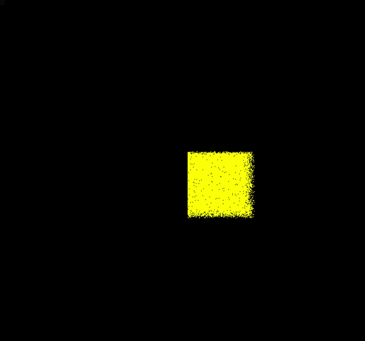

# WebGPU Material Point Method

MPM is a hybrid Eulerian/Lagrangian method for the simulation of physically accurate materials. In this project, we show off the compute capabilities of WebGPU to implement a MPM simulator allowing for the real-time simulation of 200k particles from a selection of three materials (Fluids, Jellos, and Snow).


<div class="row">
  <div class="column">
    
  </div>
  <div class="column">
    
  </div>
</div>

## More WebGPU Samples to get started with WebGPU

This repo was built from the  [WebGPU Samples Repo](//austineng.github.io/webgpu-samples/), a set of WGSL
and SPIR-V compatible samples demonstrating the use of the [WebGPU API](//webgpu.dev). Please see the current implementation status at
[webgpu.io](//webgpu.io). **Thank you so much Austin and Kai for your help with this project!**

These samples run in Chrome Canary behind the flag `--enable-unsafe-webgpu`. If
something isn't working, please file an issue
[here](https://github.com/austinEng/webgpu-samples/issues). You can get Chrome Canary [here](https://www.google.com/intl/en_in/chrome/canary/).

## Building this project
This project is built with [Typescript](https://www.typescriptlang.org/)
and compiled using [webpack](https://webpack.js.org/). Building the project
requires an installation of [Node.js](https://nodejs.org/en/).

- Install dependencies: `npm install`.
- For development, start the dev server which will watch and recompile
  sources: `npm start`.
- For production, compile the project: `npm run build`.
- To view the project locally in the browser, start a web server in the project
  root directory. [`http-server`](https://www.npmjs.com/package/http-server) is
  the recommended package.

### How to run from cloned source

```
npm install
npm run-script build   # or `npm start` and do the following in a separate terminal
npm run-script serve
```
